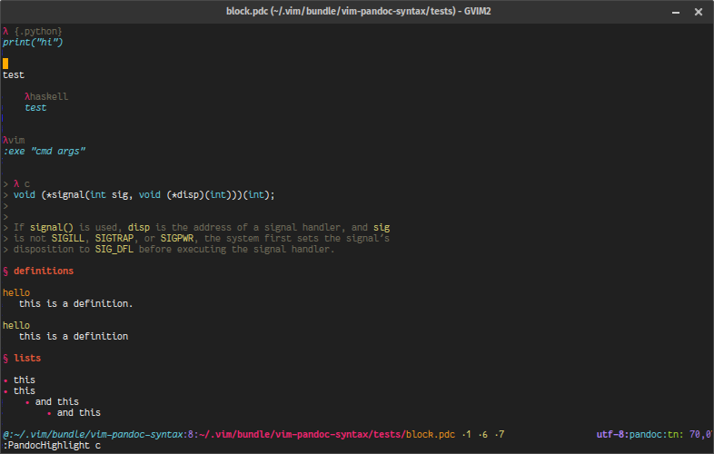
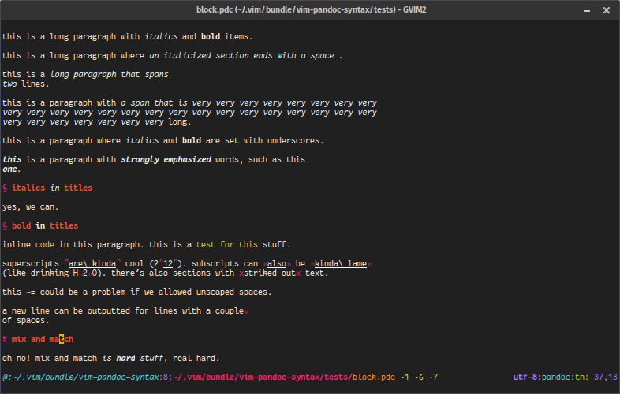
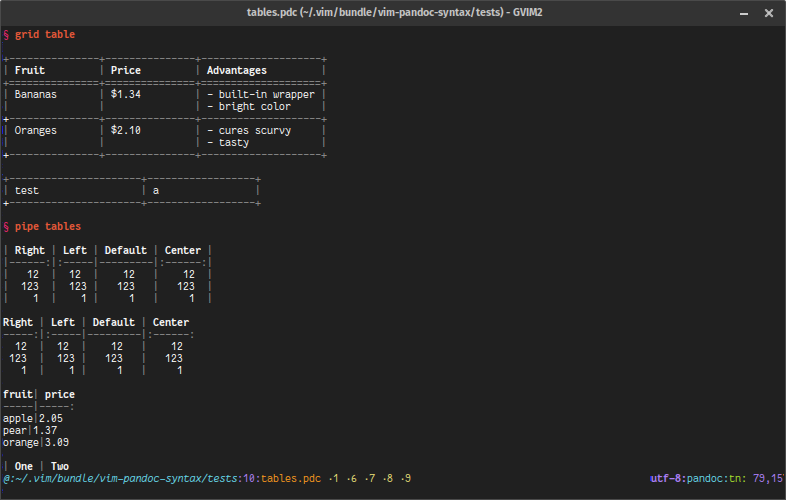
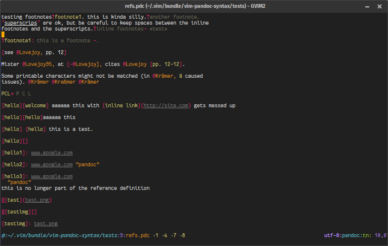

# vim-pandoc-syntax

[](https://github.com/vim-pandoc/vim-pandoc-syntax/actions?workflow=Vint)

Standalone pandoc syntax module, to be used alongside
[vim-pandoc](http://github.com/vim-pandoc/vim-pandoc).

Forked from the version provided by `fmoralesc/vim-pantondoc`, in turn taken from `vim-pandoc/vim-pandoc`.

## Requirements

* A vim version with `+conceal`
* [vim-pandoc](http://github.com/vim-pandoc/vim-pandoc), to set the
  `pandoc` filetype (otherwise you'll have to set it up yourself).

## Installation

The repository follows the usual bundle structure, so it's easy to install it using [Plug](https://github.com/junegunn/vim-plug), [pathogen](https://github.com/tpope/vim-pathogen), [Vundle](https://github.com/gmarik/vundle) or NeoBundle. 

**Plug** adds something like the following lines to `.vimrc`:

```vim
Plug 'vim-pandoc/vim-pandoc-syntax'
```

**Vundle** users should add:

```vim
Plugin 'vim-pandoc/vim-pandoc-syntax'
```

Run `:PluginInstall` after making the changes from within a `vim` session, or you can just run `vim +':PlugInstall' +':q!' +':q!'` from the command line.

A [tarball](https://github.com/vim-pandoc/vim-pandoc-syntax/archive/master.zip) is also available.

### Standalone

If you want to use `vim-pandoc-syntax` without vim-pandoc, you'll need to tell
Vim to load it for certain files. Just add something like this to your vimrc:

```vim
augroup pandoc_syntax
    au! BufNewFile,BufFilePre,BufRead *.md set filetype=markdown.pandoc
augroup END
```

## Features

* Supports most (if not all) Pandoc's markdown features, including tables,
  delimited codeblocks, references, etc.

* Can handle multiple embedded languages (LaTeX, YAML headers, many languages
  in delimited codeblocks). Some commands are provided to help with this (see
  `:help pandoc-syntax-commands`)

* Pretty display using `conceal` (optional).

* Configurable (see `:help pandoc-syntax-configuration` for an overview of the
  options).

## Screenshots





